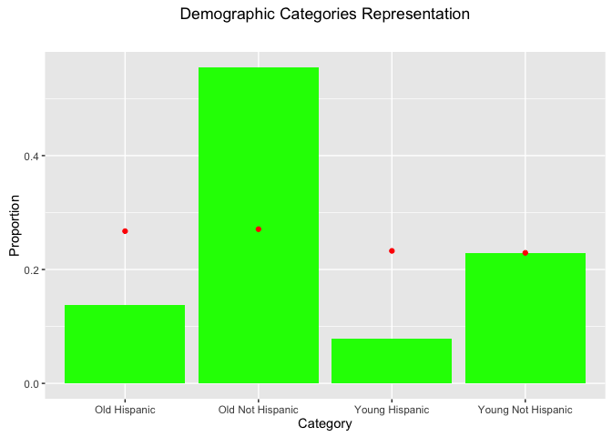

# LWV_Sampling_Errors
Oscar Padilla  
July 13, 2016  


# Exploratory Data Analysis - Voters Behavior

## Load the data file


```r
setwd("/Users/GS7271/Documents/MSDS6306/Unit8/HW8")
raw_data <- read.csv("LWV_Data.csv")
str(raw_data)
```

```
## 'data.frame':	531735 obs. of  27 variables:
##  $ VOTED2014               : int  0 0 0 0 0 0 0 0 0 1 ...
##  $ Young.Hispanic.Status   : Factor w/ 4 levels "non_y_h","non_y_non_h",..: 2 2 2 2 2 2 2 2 2 2 ...
##  $ ID.Number               : int  186 669 1483 1527 1643 1882 2164 2499 2880 3020 ...
##  $ Voter.Status            : Factor w/ 1 level "A": 1 1 1 1 1 1 1 1 1 1 ...
##  $ Voted.11.2012           : int  0 0 0 0 0 0 0 0 0 1 ...
##  $ Voted.Gen..Elec..09.2010: int  0 0 0 0 0 0 0 0 0 0 ...
##  $ Voted.Gen..Elec..07.2008: int  0 0 1 1 0 0 1 1 1 0 ...
##  $ Number.General.Elections: int  0 0 1 1 0 0 1 1 1 1 ...
##  $ Hispanic.Surname        : int  0 0 0 0 0 0 0 0 0 0 ...
##  $ Young.Voter             : int  0 0 0 0 0 0 0 0 0 0 ...
##  $ Eligible.2012           : int  1 1 1 1 1 1 1 1 1 1 ...
##  $ Eligible.2010           : int  1 1 1 1 1 1 1 1 1 1 ...
##  $ Eligible.2008           : int  1 1 1 1 1 1 1 1 1 1 ...
##  $ Young.in.2012           : int  0 0 0 0 0 0 0 0 0 0 ...
##  $ Young.in.2010           : int  0 0 0 0 0 0 0 0 0 0 ...
##  $ Young.in.2008           : int  0 0 0 0 0 0 0 0 0 0 ...
##  $ Voter.Category          : Factor w/ 4 levels "Old Hispanic",..: 2 2 2 2 2 2 2 2 2 2 ...
##  $ type                    : Factor w/ 13 levels "","Non_y_h_CONTROL",..: 1 1 1 1 1 1 1 1 1 1 ...
##  $ ID                      : int  186 669 1483 1527 1643 1882 2164 2499 2880 3020 ...
##  $ control                 : int  NA NA NA NA NA NA NA NA NA NA ...
##  $ post                    : int  NA NA NA NA NA NA NA NA NA NA ...
##  $ flyer                   : int  NA NA NA NA NA NA NA NA NA NA ...
##  $ LOWPROP                 : int  1 1 1 1 1 1 1 1 1 1 ...
##  $ city                    : Factor w/ 28 levels "","ADDISON","BALCH SPRINGS",..: 7 7 4 4 6 4 7 4 4 10 ...
##  $ zip                     : int  75230 75229 75006 75006 75019 75006 75251 75006 75006 75234 ...
##  $ U_S__CONGRESS           : int  24 32 24 24 24 24 32 24 24 24 ...
##  $ byear                   : int  1938 1953 1911 1931 1948 1928 1926 1919 1924 1944 ...
```

```r
# Verify the number of individuals who received the flyer
nrow(raw_data[!is.na(raw_data$flyer) & raw_data$flyer == 1, ])
```

```
## [1] 8000
```

## Analyze the population by segmenting in demographic groups ~ *Categories*


```r
raw_data_Category <- summaryBy(VOTED2014 ~ Voter.Category, data = raw_data, FUN = c(length, sum), var.names = c("Category", "Population"))
raw_data_Category$proportion <- prop.table(raw_data_Category$VOTED2014.length)
raw_data_Category$participation <- raw_data_Category$VOTED2014.sum / raw_data_Category$VOTED2014.length
raw_data_Category
```

```
##       Voter.Category VOTED2014.length VOTED2014.sum proportion
## 1       Old Hispanic            73380          6918 0.13800107
## 2   Old Not Hispanic           295050         51521 0.55488166
## 3     Young Hispanic            41739          3236 0.07849587
## 4 Young Not Hispanic           121566         16365 0.22862140
##   participation
## 1    0.09427637
## 2    0.17461786
## 3    0.07752941
## 4    0.13461823
```
From the data below we can clearly see that Hispanic voting participation 8.820438% is much lower than their *Not Hispanic* counterparts.

##Analyze the sample data by segmenting in the same demographic groups


```r
experiment <- raw_data[complete.cases(raw_data), ]
experiment_Category <- summaryBy(VOTED2014 ~ Voter.Category, data = experiment, FUN = length, keep.names = TRUE, var.names = c("Category", "Population"))
experiment_Category$proportion <- prop.table(experiment_Category$VOTED2014)
experiment_Category
```

```
##       Voter.Category VOTED2014 proportion
## 1       Old Hispanic      6416  0.2673333
## 2   Old Not Hispanic      6499  0.2707917
## 3     Young Hispanic      5584  0.2326667
## 4 Young Not Hispanic      5501  0.2292083
```

As opposed to the general population, where Old Not Hispanic represent more than half of the electorate, the sample data is almost uniformly segmented, i.e.  each demographic has an equal weight.

## Comparison of Population Demographic Proportion vs. Sample Demo Proportions


```r
raw_v_experiment <- merge(raw_data_Category, experiment_Category, by = "Voter.Category")
names(raw_v_experiment) <- c("Category", "Pop", "Voters", "Pop_prop", "Participation", "Exp", "Exp_prop")
raw_v_experiment
```

```
##             Category    Pop Voters   Pop_prop Participation  Exp  Exp_prop
## 1       Old Hispanic  73380   6918 0.13800107    0.09427637 6416 0.2673333
## 2   Old Not Hispanic 295050  51521 0.55488166    0.17461786 6499 0.2707917
## 3     Young Hispanic  41739   3236 0.07849587    0.07752941 5584 0.2326667
## 4 Young Not Hispanic 121566  16365 0.22862140    0.13461823 5501 0.2292083
```

```r
g <- ggplot(data = raw_v_experiment, aes(x = Category))
g <- g + geom_bar(aes(y = Pop_prop), stat = "identity", fill = "green", position = "dodge")
g <- g + geom_point(aes(y = Exp_prop), stat = "identity", color = "red")
g <- g + ggtitle(expression(atop("Demographic Categories Representation"), atop("General Population vs. Experiment"), "")) + theme(legend.position = "top") + ylab("Proportion")
g
```

<!-- -->

## Analysis

The chart above clearly indicates how Old and Young Hispanics are over represented in the sample data (red dots). As part of the overall population (green bars) these two groups only represent 13% and 7% respectively. However, in the sample data their representation is inflated to equate the other Not Hispanic groups (23% - 26%). In contrast, Not Hispanic groups (old and young) are under represented.
By over representing Hispanics in the sample, we alter the behavior of the experiment because this group has half the voting participation of Not Hispanic.

## Other *noise* factors

### Eligibility

Assuming the *Eligible* variable describes who can vote, it was found that 318 people voted in 2008 despite being non-eligible (Eligible = 0). Same applies to 2012 election data, where the number soars to 1141 uneligible voters.

### Presidential vs. Mid-Term Elections

Overall voters participation during Presidential elections in 2008 and 2012 was 12.5919866% and 25.0555258%, respectively, which tends to be higher than 1.0277676% and 14.6764836% in 2010 and 2014, respectively, which were Mid-Term elections.
